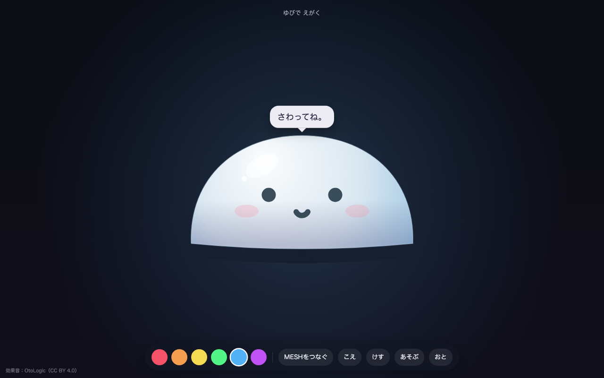
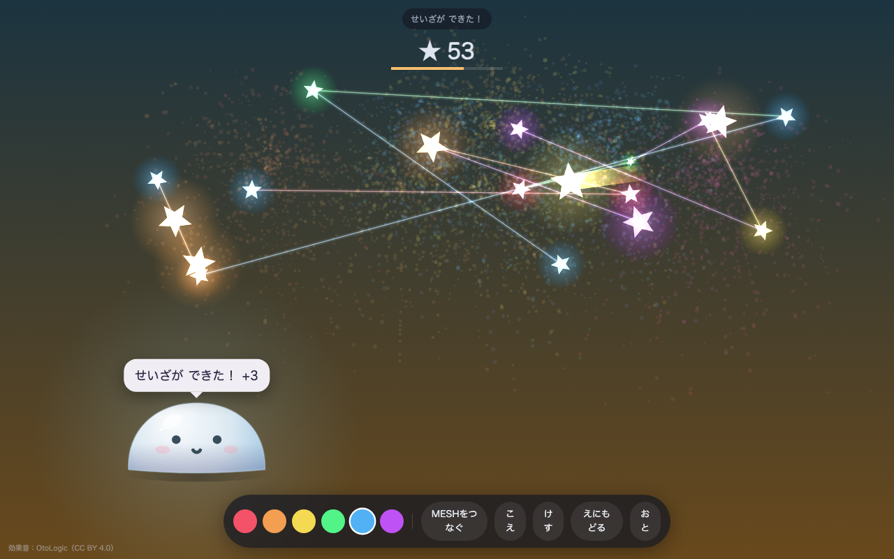
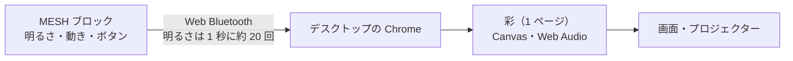
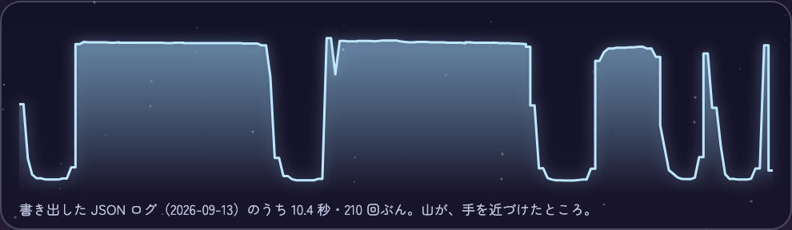

# 彩 / Irodori — もちと あそぶ、よるの おえかき

[](https://github.com/hocky0301/irodori-mochi/actions/workflows/ci.yml)

**あそぶ：https://hocky0301.github.io/irodori-mochi/**　／　**もちの発表資料：https://hocky0301.github.io/irodori-mochi/deck/mochi.html**

Sony の MESH ブロックに手を近づけると、画面の「もち」がむにっと潰れて、離すと小さなもちが飛んでいく。同じ手の動きで、ためて跳んで星を集めるゲームにもなる。Art for Well-being のハッカソン（2 日間）で、チームで作った。



> Irodori is a playful drawing piece built at a 2-day Art for Well-being hackathon. Bring a hand near a Sony MESH brightness block and an on-screen mochi squishes; let go and it flings little mochi that stick to the painting. The same gestures play "Mochi Jump", a no-fail game of charging jumps and catching stars. It runs in the browser as a single page with no network access; MESH blocks connect from desktop Chrome over Web Bluetooth. Without blocks, you can press the mochi with a finger or the mouse, or use the on-screen stand-ins for the brightness, button and motion blocks. No effects in care settings have been evaluated.

## 遊び方

ブロックがなくても、**もちを指（マウス）で押す**、**スペースキー**、**画面右の「MESHのかわり」ボタン**で遊べる。画面右の「発表スライド」で、共有会で使ったスライドが別のタブで開く。

| 使うもの | すること | 起きること |
|---|---|---|
| 明るさブロック（基本） | 手を近づける | もちが近さに合わせて潰れる。押し続けると汗をかいて「むむむ」 |
| 〃 | 離す | ぷるんと戻って、小さなもちを飛ばす。飛んだもちは色のしみとして絵に残る |
| 動きブロック（おまけ） | 振る | 背景が 月面 → 火星 → 木星 → 土星 → 夜空 とめぐる |
| ボタンブロック | 押す | ロケットがゆっくり空へ上がって、花火になる |
| 指・マウス | もちを押して離す | 明るさブロックと同じ |
| 〃 | 画面をなぞる | 光る線を描く |
| 画面右の「MESHのかわり」 | あかるさ を押し続けて離す／ボタン／うごき | それぞれ明るさ・ボタン・動きブロックと同じ。実物と同じ形のバイト列を入力の処理に渡し、あかるさは押している間、近さの値を 1 秒に 20 回送る |
| 画面下のバー | 「あそぶ」／「おと」 | ゲームと絵を切り替える／音を消す |
| キーボード | `G` `M` `R` `B` | ゲーム／消音／ロケット／背景 |

### 手の動きを 5 つに見分ける

明るさブロックの値は 1 秒に約 20 回届く。近づけている長さと、離す速さで、反応を変えている。

| 手の動き | 見分け方 | もち |
|---|---|---|
| ちょん | 0.25 秒未満で離す | ぴょんとはねる |
| 短め／長め／握る | 0.7 秒未満／2.5 秒未満／それ以上 | 2 つ／4 つ／7 つ飛ばす（握ると花火） |
| じっと | 近さのゆらぎが小さいまま 12 秒 | 眠る。離すと「おはよう」 |
| パッと／そっと離す | ピークから 0.15 秒以内／それより遅い | 速く飛ぶ／ふわっと落ちる |

### もちジャンプ



- 手を近づけている長さ（指やスペースなら押している長さ）で、跳ぶ高さをためる。**点線が「いま離すと、ここまで跳ぶ」**
- 星に触れると取れて、夜空に残る。1 回のジャンプで続けて取ると「れんさ」になり、取った星どうしが線でつながって星座になる
- **そっと離すと、下りだけゆっくりになる**。手を速く動かせない人のほうが星を取りやすいように
- ときどき流れ星。星 5 個ごとに「ドーン」、20 個ごとに夜が明ける
- 取れなかった星は流れていくだけで、点数は減らない。失敗して終わることはない

### さいしょの あいさつ

開くと、大きなもちが「さわってね」と待つ。触ると、ひらがなだけで挨拶して、画面の下へ移る。ブラウザは一度も触っていない画面では音を鳴らせないため、最初の一回だけ触ってもらう。

## なぜ作ったか

病室やプレイルームの夜。できることが少ない時間に、手をちょっと動かすだけで遊べるものを考えた。チームの理学療法士のコメントを要約すると、「しんどいから動きたくない、がベースにある。それを、楽しいから気づいたら動いている、にできるとよい」。

子どもや病室で意味があるかは、まだ何も確かめていない。

## しくみ



- 作品は `index.html` 1 ファイル。外部のライブラリ・画像・フォントを読み込まず、インターネットには何も送らない
- もち、星、背景の月面・火星・木星・土星は、Canvas でその場で描く
- 効果音は OtoLogic の素材を埋め込み、押している間の音・うなり声・もちのしゃべり声は Web Audio で合成する
- マイクを使う「こえ」は、声の大きさだけを読む。録音も保存も送信もしない
- `prefers-reduced-motion` のとき、花火・またたき・画面の揺れを抑える

### MESH との通信

| UUID | 種類 | 使い道 |
|---|---|---|
| `72c90001-57a9-4d40-b746-534e22ec9f9e` | Service | 接続先 |
| `72c90003-57a9-4d40-b746-534e22ec9f9e` | Notify | 出来事とセンサー値 |
| `72c90004-57a9-4d40-b746-534e22ec9f9e` | Write | 機能の有効化（`00 02 01 03`）と、明るさブロックのモード設定 |
| `72c90005-57a9-4d40-b746-534e22ec9f9e` | Indicate | 接続直後の基本情報 |

明るさブロックには、通知モード `0x24`（公式の `0x04`「近接センサー値が変化」と `0x20`「定時通知」の和）を送る。近接値は状態通知の 0 から数えて 4・5 番目のバイト（リトルエンディアン、0〜4095）。

## 実物で確かめたこと（2026-09-13）



| 確かめたこと | 結果 |
|---|---|
| 明るさブロック | Mac の Chrome で実物につながった |
| 近接の通知 | 204 秒で 4,111 回。平均 49.7 ms ごと（1 秒に約 20 回）。公式ドキュメントの定時通知は「500 ms 毎」 |
| チェックサム | 4,111 回すべて一致 |
| 近接の値 | 手がないときは 26 が最も多く（最小 24）、近づけると最大 671 |
| 動きブロック | 最初はつながらず、その後「振る」が Mac で動いた。つながり方はまだ安定していない |
| ボタンブロック | 実物での動作は記録していない |

**まだ確かめていないこと**

- 子どもや病室で意味があるか
- ほかの人の手で、手の動きの境目（開発中にとった記録から決めた）が合うか
- iPhone・iPad（ブラウザが Web Bluetooth に対応していないため、ブロックはつながらない。指では遊べる）

## チームの理学療法士に聞いたこと（要約）

| 観点 | コメントの要約 |
|---|---|
| 手の動き | 点滴が入っていると、大きく振る動きは制限されることがある。感度を調整すれば振るもできそう |
| 映す場所 | 天井だけでなく、カーテン（横の壁）に映せれば、横向きしかできない子も楽しめる |
| 安全 | 最初はリハビリや看護師と一緒に。親子でできれば、親の心のケアにも。アルコール綿で拭ける素材の工夫を |
| 注意 | 熱中しすぎたり、競争が生まれる仕掛けは、体によくない |
| 確かめ方 | 活動量計、睡眠時間、手術後の子のせん妄の観察スケール |

これを受けて、明るさブロック（かざすだけ）を基本にし、振るはおまけにした。

## これから

- 横の壁（カーテン）にも映せるように
- 遊びすぎたら、もちが「やすもう」と声をかける。点数を出さない遊び方
- 振る感度の調整
- 花火のまぶしさや「ドーン」の音を弱められるように
- アルコール綿で拭けるカバー
- 最初はリハビリの方・看護師さんと一緒に、親子で試す

## 動かす

MESH ブロックをつなぐには、`https` か `localhost` で開く必要がある（Web Bluetooth の制約）。GitHub Pages 版はそのままつなげる。

```bash
./start.sh
```

`http://127.0.0.1:8790/` を Chrome で開く。URL の後ろに付けられるもの：

| 付けるもの | 内容 |
|---|---|
| `?game=1` | ゲームで始める |
| `?intro=0` | さいしょの あいさつを出さない |
| `?mochi=1` | ブロックなしで、もちを出す |
| `?debug=1` | 診断パネル。届いた通知を JSON で書き出せる（基本情報フレームにはシリアル番号が含まれるので、共有前に確認する） |
| `?still=60` | 「じっと」と判定するまでの秒数 |

発表資料は `deck/mochi.html`。スペースで次のスライド、`M` で消音。

### テスト

```bash
npm ci
npx playwright install chromium
npm test
```

Playwright で 44 件。実物の明るさブロックの記録から切り出した 10.4 秒・210 回ぶん（`tests/fixtures/pa-hand-20260913.json`、近接の状態通知だけで機器の識別情報は含まない）を、記録どおりの時刻に流し直すテストを含む。

## クレジット

- 制作：Irodori team（Art for Well-being ハッカソン）
- 理学療法の視点：チームの理学療法士
- 効果音：[OtoLogic](https://otologic.jp)（[CC BY 4.0](https://creativecommons.org/licenses/by/4.0/deed.ja)）。Onoma-Pop01/03/04、Onoma-Button-Click01、Onoma-Surprise06、Onoma-Sparkle08/09、Anime_Motion14、Retro_Anime-Jet04 を、無音部分を切り詰めてモノラルに変換し、再生速度を変えて使用している
- MESH は Sony の製品。本作品は Sony とは関係のない個人・チームの制作物

## ライセンス

ソースコードは MIT License（[LICENSE](LICENSE)）。埋め込んだ効果音は OtoLogic の CC BY 4.0 で、MIT の対象外。
